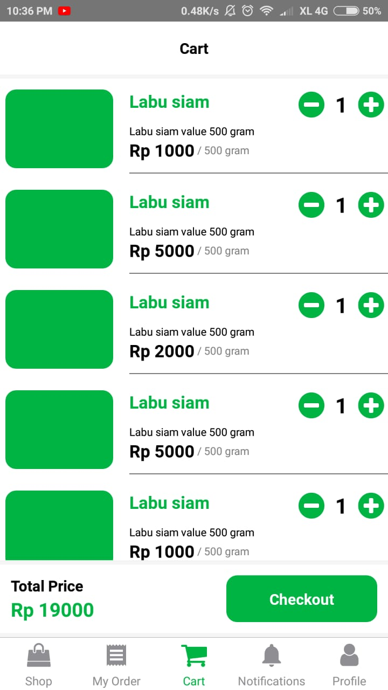

<h1 align="left">Tooko-in</h1>

    

  1-Week E-commerce Collaboration Project

  Built with <b>React Native</b> and integrated with <b>ExpressJS</b>.

## Table of Contents

- [Introduction](#introduction)
- [Features](#features)
- [Requirements](#requirements)
- [Screenshots](#screenshots)
- [Release APK](#release-apk)
- [Contributors](#contributors)

## Introduction
<b>Tooko-in</b> is a simple e-commerce mobile application that can engaged in agriculture where the target is farmers who can sell their products through this application and the target buyers are people who do not want to queue in the market only through the application of goods can be sent according to procedure.

## Features
* Buyer/Seller must sign up and sign in to make a transaction and see their profiles
* Seller can add and manage their products to sell to customers
* Buyer can search and buy product
* User can reset password using forget password features
* User can manage their profiles (Not Fully Functional)

## Requirements
* [`NPM`](https://www.npmjs.com/get-npm)
* [`react-native`](https://facebook.github.io/react-native/docs/getting-started)
* [`react-native-cli`](https://facebook.github.io/react-native/docs/getting-started)
* [`Tooko-in`](https://github.com/tookoin/fe-tookoin-react-native-redux)

## Screenshots

    
    
    
    
    
    
    

## Release APK

## Contributors

  <table>
    <tr>
      <td align="center">
        <a href="https://github.com/melankolia">
           
          <b>Ageng Setyo Nugroho</b>
        </a>
      </td>
            <td align="center">
        <a href="https://github.com/bmf10">
           
          <b>Bima Febriansyah</b>
        </a>
      </td>
            <td align="center">
        <a href="https://github.com/husenmalik7">
           
          <b>Husen Malik</b>
        </a>
      </td>
            <td align="center">
        <a href="https://github.com/xbaldiq">
           
          <b>Iqbaldhia</b>
        </a>
      </td>
    </tr>
  </table>

